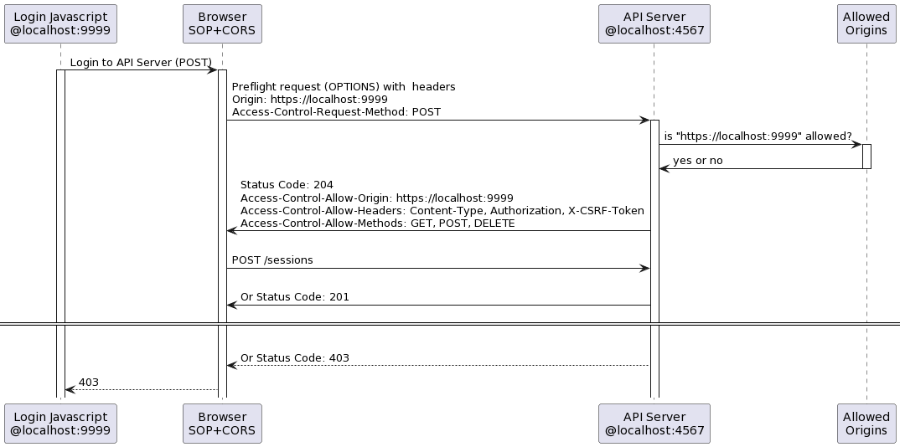
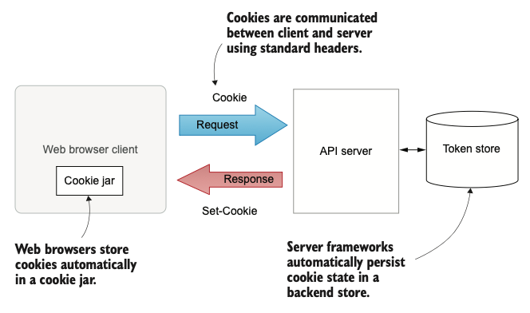
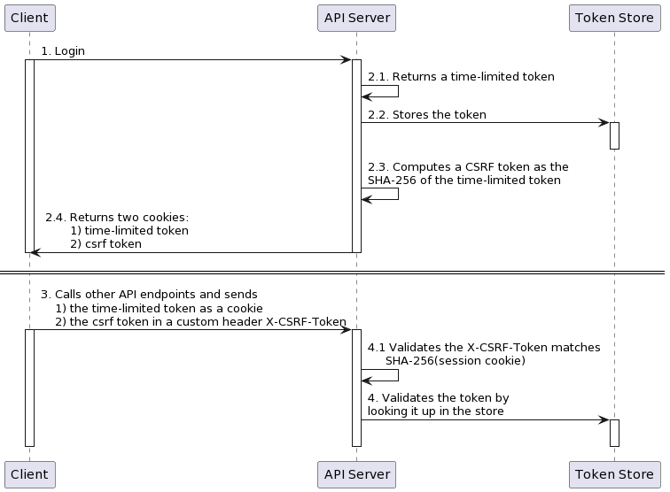

# Chatter - Project for API Security Study - Reversion 3

<style>
    h1 {
        color: DarkRed;
        text-align: center;
    }
    h2 {
        color: DarkBlue;
    }
    h3 {
        color: DarkGreen;
    }
    h4 {
        color: DarkMagenta;
    }
    strong {
        color: Maroon;
    }
    em {
        color: Maroon;
    }
    img {
        display: block;
        margin-left: auto;
        margin-right: auto
    }
    code {
        color: SlateBlue;
    }
    mark {
        background-color:GoldenRod;
    }
</style>

## Enhancements in this revision

### Supporting CORS



### Storing token state using the web Storage API



Cookies provide three key components of token-based authentication:
- Client side token storage
- Server-side state
- A standard way to communicate cookies between the client and the server with the `Set-Cookie` and `Cookie` headers

### Using the standard Bearer HTTP authentication scheme



For APIs, the CSRF token is sent in response JSON.

### Hardening database token storage


## Important points

- HTTP Basic authentication is awkward for web browser clients and has a poor user experience. You can use token-based authentication to provide a more nat- ural login experience for these clients.
- For web-based clients served from the same site as your API, session cookies are a simple and secure token-based authentication mechanism.
- Session fixation attacks occur if the session cookie doesn’t change when a user authenticates. Make sure to always invalidate any existing session before logging the user in.
- CSRF attacks can allow other sites to exploit session cookies to make requests to your API without the user’s consent. Use SameSite cookies and the hash-based double-submit cookie pattern to eliminate CSRF attacks.

## Testing

1. Register a `test` user
    ```bash
    curl -i --cacert "$(mkcert -CAROOT)/rootCA.pem" \
    -d '{"username":"test","password":"password"}' \
    -H 'Content-Type: application/json' https://localhost:4567/users
    ```
2. Call the `/sessions` endpoint passing in the username and password using HTTP basic authentication to get a new session cookie. This command also saves any cookies to a file (known as a cookie jar).
    ```bash
    curl -i --cacert "$(mkcert -CAROOT)/rootCA.pem" \
    -u test:password \
    -c /tmp/cookiejar \
    -H 'Content-Type: application/json' \
    -X POST https://localhost:4567/sessions
    ```
3. Call an API endpoint passing in the cookie and the X-CSRF-Token header
    ```bash
    curl -i --cacert "$(mkcert -CAROOT)/rootCA.pem" \
    -b /tmp/cookiejar \
    -H 'Content-Type: application/json' \
    -H 'X-CSRF-Token: mFeDbVbFbpwe--4dPYpgQ68f-2iD9jZwdRK-azNeXik' \
    -d '{"name": "test space", "owner": "test"}' \
    https://localhost:4567/spaces
    ```
4. Go to https://localhost:4567/chatter.html. Enter anything string in the fields. The Login page will appear. Enter a valid username and password and click the Login button. The Chatter! page will show up. Enter a space name and a valid username as the owner, and click the Create button. The following message will display on the Javascript console:
    ```text
    Created space:  demo /spaces/1
    ```
5. Logout
    ```bash
    curl -i --cacert "$(mkcert -CAROOT)/rootCA.pem" \
    -b /tmp/cookiejar \
    -H 'Content-Type: application/json' \
    -H 'X-CSRF-Token: mFeDbVbFbpwe--4dPYpgQ68f-2iD9jZwdRK-azNeXik' \
    -X DELETE https://localhost:4567/sessions
    ```
