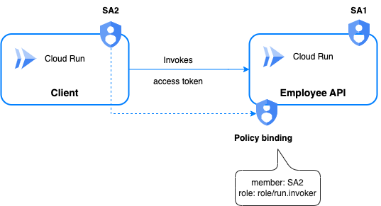

# Service-to-service Authentication

## Introduction

I will create a client application that knows how to call the Employee API. This application simply listens on port 8080 and when a request comes, calls the `/api/employee` endpoint of the Employee API. It is deployed as a Cloud run service itself.

A new service account is created for this Cloud Run service to run with. A IAM policy binding (role/run.invoker) is created to allow this service account to invoke the Employee API.

The client Cloud Run service must present a valid ODIC token when calling the Employee API. The client does this by calling the local metadata server using GCP client library.



## Environment variables
```bash
GOOGLE_CLOUD_PROJECT=ibcwe-event-layer-f3ccf6d9
REPOSITORY=us-central1-docker.pkg.dev/$GOOGLE_CLOUD_PROJECT/cloud-run-try
```
## Build

### Working version
```bash
gcloud builds submit --tag $REPOSITORY/client
```

### Bad version
```bash
mv main.go main.go.bak
mv main.go.bad main.go
gcloud builds submit --tag $REPOSITORY/client:bad
```

## Deployment

### Service account
```bash
gcloud iam service-accounts create emp-api-client
```

### Role binding
```bash
gcloud run services add-iam-policy-binding employee-api \
--member=serviceAccount:emp-api-client@ibcwe-event-layer-f3ccf6d9.iam.gserviceaccount.com \
--role=roles/run.invoker
```

### The Client Cloud Run service
```bash
# get Employee API's url
EMPLOYEE_API=$(gcloud run services describe employee-api --format "value(status.url)")
 
gcloud run deploy client --image $REPOSITORY/client \
--set-env-vars EMPLOYEE_API=$EMPLOYEE_API \
--service-account emp-api-client@ibcwe-event-layer-f3ccf6d9.iam.gserviceaccount.com
```

## Test

### With bad version - no valid access token present
```bash
CLIENT_URL=$(gcloud run services describe client --format "value(status.url)")
curl -H "Authorization: Bearer $(gcloud auth print-identity-token)" $CLIENT_URL
```
And we get:
```html
<html><head>
<meta http-equiv="content-type" content="text/html;charset=utf-8">
<title>403 Forbidden</title>
</head>
<body text=#000000 bgcolor=#ffffff>
<h1>Error: Forbidden</h1>
<h2>Your client does not have permission to get URL <code>/api/help</code> from this server.</h2>
<h2></h2>
</body></html>
```

### With working version
```
CLIENT_URL=$(gcloud run services describe client --format "value(status.url)")
curl -H "Authorization: Bearer $(gcloud auth print-identity-token)" $CLIENT_URL
```
We will get
```text
Employee API v1. You are vistor number 7
```

## Cleanup

```bash 
gcloud run services delete client
 
gcloud iam service-accounts delete emp-api-client@ibcwe-event-layer-f3ccf6d9.iam.gserviceaccount.com
  
gcloud artifacts packages delete client --repository=cloud-run-try --location=us-central1
```