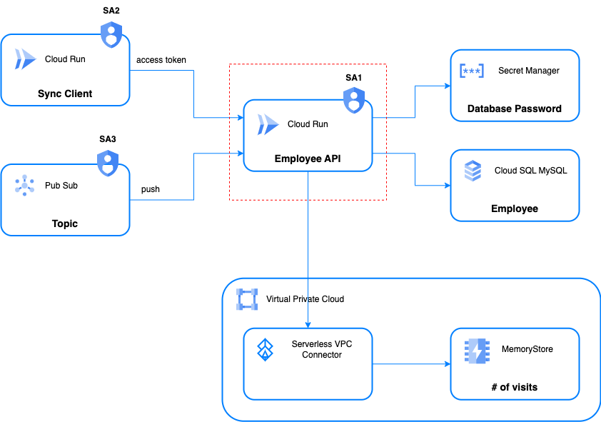

# Employee API - a POC on Google Cloud Run, Cloud Build, Cloud Deploy and Terraform

## Purpose

This POC is to explore how Google Cloud Run can be used as a platform for some simple microservices, along with other Google Cloud products, such as Cloud Build, Cloud Deploy and Secret Manager. 

Finally, Terraform is used to deploy all the required resources to support the idea of infrastructure as code.

## Architecture



- The application exposes an employee API endpoint which provides CRUD operations on the Employee resource.
- CloudSQL MySQL is used as the data store
- The application code uses the [Cloud SQL connectors](https://cloud.google.com/sql/docs/mysql/connect-connectors) library to connect to MySQL (other options: Unix Socket, TCP Socket)
- The database password is stored in Secret Manager
- The application is deployed as a Cloud Run service using a service account which has two roles:
    - roles/cloudsql.client
    - roles/secretmanager.secretAccessor

## Installing Tools

### Installing Cloud SQL Proxy
```bash
curl -o cloud-sql-proxy \
https://storage.googleapis.com/cloud-sql-connectors/cloud-sql-proxy/v2.4.0/cloud-sql-proxy.linux.amd64
 
chmod +x cloud-sql-proxy
sudo mv cloud-sql-proxy /usr/local/bin
```

###  Installing MySQL Client
```bash
sudo apt-get install mysql-client
```

## Create a Source Repo

```bash
git config --global credential.'https://source.developers.google.com'.helper gcloud.sh
gcloud source repos create employee-api
git init
git remote add google https://source.developers.google.com/p/ibcwe-event-layer-f3ccf6d9/r/employee-api
```

## Local testing

Only Docker engine is required. Run the following command:
```bash
docker-compose up
```

## Building and Deploying Manually

### Enabling Google APIs

```bash
# Enable Artifact Registry in your project
gcloud services enable artifactregistry.googleapis.com
 
# Enable CloudSQL APIs
gcloud services enable sqladmin.googleapis.com
gcloud services enable sql-component.googleapis.com
```

### Environment Variables
```bash
GOOGLE_CLOUD_PROJECT=ibcwe-event-layer-f3ccf6d9
REPOSITORY=us-central1-docker.pkg.dev/$GOOGLE_CLOUD_PROJECT/cloud-run-try
```

### Creating an Artifact Registry Repository
```bash
gcloud artifacts repositories create \
--location us-central1 \
--repository-format docker \
cloud-run-try
```

Set up credentials to access the repo
```bash
gcloud auth configure-docker us-central1-docker.pkg.dev
```

### Building the Container Image

#### Using Docker
```bash
cd src
# Build the docker image.
docker build -t $REPOSITORY/employee .
 
# Set up credentials to access the repo
gcloud auth configure-docker us-central1-docker.pkg.dev
 
# Push the image
docker push $REPOSITORY/employee
 
# Verify the image is built and pushed successfully
gcloud run services list
```

#### Using Cloud Build

```bash
cd src
gcloud builds submit --tag $REPOSITORY/employee
```

### Deploying 

#### Creating CloudSQL Database

```bash
# Create a Cloud SQL instance named sql-db
gcloud sql instances create sql-db \
--tier db-f1-micro \
--database-version MYSQL_8_0 \
--region us-central1
 
# Create the hr database
gcloud sql databases create hr --instance sql-db
```

#### Creating a Secret in Secret Manager

Run the following command to create a secret named "DB_PASS":

```bash
echo -n "changeit" | gcloud secrets create DB_PASS \
--replication-policy automatic --data-file=-
```

To verify the secret is created successfully, run this command to access the content of the version 1 of DB_PASS:
```bash
gcloud secrets versions access 1 --secret DB_PASS
```

#### Deploying the Cloud Run Service

Obtain the CloudSQL instance connection name which is required in the next step:
```bash
gcloud sql instances describe sql-db|grep -i connection | awk '{print $2}'
```

Run this command to deploy the Employee API to us-central1 region:
```bash
gcloud run deploy employee-api --image $REPOSITORY/employee \
--service-account=gyre-dataflow@ibcwe-event-layer-f3ccf6d9.iam.gserviceaccount.com \
--add-cloudsql-instances ibcwe-event-layer-f3ccf6d9:us-central1:sql-db \
--set-env-vars DB_USER=root \
--set-secrets DB_PASS=DB_PASS:1 \
--set-env-vars DB_NAME=hr \
--set-env-vars DB_PRIVATE_IP= \
--set-env-vars INSTANCE_CONNECTION_NAME=ibcwe-event-layer-f3ccf6d9:us-central1:sql-db
```

Run the following command to verify the service is running:
```bash
$ gcloud run services list
   SERVICE       REGION       URL  
✔  employee-api  us-central1  https://employee-api-oy6beuif2a-uc.a.run.app
```

## Deploying with Terraform

```bash
cd tf
terraform init
terraform apply --auto-approve
```

## Testing

### Table Preparation

1. Get the instance connection name that is required in step 2.
	```bash
	gcloud sql instances describe sql-db|grep -i connection | awk '{print $2}'
	```
2. Start the cloud sql proxy to connect to `sql-db`
	```bash
	cloud-sql-proxy --port 3306 \
    ibcwe-event-layer-f3ccf6d9:us-central1:sql-db
3. Connect with the mysql client
    ```bash
	mysql -u root --host 127.0.0.1
	```
4. Test the connection
	```bash
	mysql> show databases;
	+--------------------+
	| Database           |
	+--------------------+
	| hr                 |
    | information_schema |
	| mysql              |
	| performance_schema |
	| sys                |
	+--------------------+
	5 rows in set (0.00 sec)
	```
5. Create and populate the EMPLOYEE table
	```bash
    cd src
	mysql -u root --host 127.0.0.1 hr < schema.sql
	```

### Hitting the Endpoints

#### Display API version information
```bash
EMPLOYEE_API=$(gcloud run services describe employee-api --format "value(status.url)")
 
curl -H "Authorization: Bearer $(gcloud auth print-identity-token)" \
$EMPLOYEE_API/api/help
```
Output:
```text
Employee API v4
```
#### List all employees
```bash
curl -H "Authorization: Bearer $(gcloud auth print-identity-token)" \
$EMPLOYEE_API/api/employee | jq
```
Output:
```json
[
    {
        "id": "1",
        "first_name": "John",
        "last_name": "Doe",
        "department": "Products",
        "salary": 200000,
        "age": 25
    },
    {
        "id": "2",
        "first_name": "Jane",
        "last_name": "Doe",
        "department": "Sales",
        "salary": 100000,
        "age": 22
    }
]
```

#### Create a new employee
```bash
curl -H "Authorization: Bearer $(gcloud auth print-identity-token)" \
-d '{"first_name":"Shrek","last_name":"Unknown","department":"Royal","salary":200000,"age":25}' \
-X POST $EMPLOYEE_API/api/employee | jq
```
Output:
```json
{
    "id": "3",
    "first_name": "Shrek",
    "last_name": "Unknown",
    "department": "Royal",
    "salary": 200000,
    "age": 25
}
```

## Cleanup

### Manual Cleanup

```bash
gcloud run services delete employee-api
 
gcloud sql instances delete sql-db 
 
gcloud artifacts packages delete employee --repository=cloud-run-try \
--location=us-central1
```

### Using Terraform

```bash
terraform destroy
```
